# Understanding Pythonic RAG: The Nuts and Bolts

## 🎯 The Why Behind Pythonic RAG

This document dives deep into the **mathematical foundations**, **algorithmic mechanics**, and **information flow** of the Pythonic RAG system. We'll explore what's happening under the hood before moving to useful abstractions.

## 📊 RAG Process Flow Diagram

```mermaid
flowchart TD
    %% Data Preparation Phase
    A[📄 Source Documents<br/>PMarcaBlogs.txt] --> B[🔄 TextFileLoader<br/>Load text files]
    B --> C[📊 Single Document<br/>In memory]
    C --> D[✂️ CharacterTextSplitter<br/>chunk_size=1000<br/>chunk_overlap=200]
    D --> E[📑 Split Documents<br/>373 chunks]
    
    %% Embedding Phase
    E --> F[🤖 EmbeddingModel<br/>text-embedding-3-small<br/>dimension=1536]
    F --> G[⚡ async_get_embeddings<br/>Batch processing]
    G --> H[🗄️ VectorDatabase<br/>Store text + embeddings]
    
    %% Query Processing Phase
    I[❓ User Query<br/>What is the Michael Eisner<br/>Memorial Weak Executive Problem?] --> J[🔍 Query Embedding<br/>Same embedding model]
    J --> K[📏 Cosine Similarity<br/>Compare query vs all vectors]
    K --> L[🎯 Top K Results<br/>k=3 most similar chunks]
    
    %% RAG Pipeline Phase
    L --> M[📝 Context Assembly<br/>Format retrieved chunks]
    M --> N[🎭 System Prompt<br/>RAG_SYSTEM_TEMPLATE<br/>Instructions for LLM]
    M --> O[👤 User Prompt<br/>RAG_USER_TEMPLATE<br/>Context + Query]
    
    N --> P[🧠 ChatOpenAI<br/>gpt-4o-mini]
    O --> P
    P --> Q[💬 Final Response<br/>Context-aware answer]
    
    %% Pipeline Class
    R[🏗️ RetrievalAugmentedQAPipeline<br/>Orchestrates entire process] -.-> H
    R -.-> I
    R -.-> Q
    
    %% Styling for black text
    classDef default fill:#f9f9f9,stroke:#333,stroke-width:2px,color:#000000
    classDef dataNode fill:#e1f5fe,stroke:#0277bd,stroke-width:2px,color:#000000
    classDef processNode fill:#f3e5f5,stroke:#7b1fa2,stroke-width:2px,color:#000000
    classDef modelNode fill:#fff3e0,stroke:#ef6c00,stroke-width:2px,color:#000000
    classDef resultNode fill:#e8f5e8,stroke:#2e7d32,stroke-width:2px,color:#000000
    
    class A,C,E,I,L,M dataNode
    class B,D,F,G,J,K,N,O processNode
    class H,P,R modelNode
    class Q resultNode
```



---

## 🧮 What's Happening Under the Hood: Vector Database

### The Mathematical Foundation

The Vector Database is built on **high-dimensional vector mathematics**. Here's what's really happening:

#### 1. **Embedding Creation Process**

```python
def get_embedding(self, text: str) -> List[float]:
    embedding = self.client.embeddings.create(
        input=text, model=self.embeddings_model_name
    )
    return embedding.data[0].embedding
```

**What OpenAI's `text-embedding-3-small` Actually Does:**
- Takes input text (up to 8,191 tokens)
- Processes through a **transformer neural network**
- Outputs a **1,536-dimensional vector** where each dimension represents a learned semantic feature
- Each dimension is a **float between -1 and 1**

#### 2. **Vector Storage Mechanism**

```python
class VectorDatabase:
    def __init__(self, embedding_model: EmbeddingModel = None):
        self.vectors = defaultdict(np.array)  # Key insight: Dictionary storage
        self.embedding_model = embedding_model or EmbeddingModel()

    def insert(self, key: str, vector: np.array) -> None:
        self.vectors[key] = vector  # O(1) insertion
```

**Storage Reality:**
- **Data Structure**: Simple Python dictionary (`defaultdict`)
- **Key**: Original text chunk (string)
- **Value**: NumPy array of 1,536 floats
- **Memory Usage**: ~6KB per chunk (1,536 × 4 bytes per float)
- **No Indexing**: Linear search through all vectors (O(n) complexity)

#### 3. **Cosine Similarity: The Core Math**

```python
def cosine_similarity(vector_a: np.array, vector_b: np.array) -> float:
    """Computes the cosine similarity between two vectors."""
    dot_product = np.dot(vector_a, vector_b)      # Σ(ai × bi)
    norm_a = np.linalg.norm(vector_a)             # √(Σ(ai²))
    norm_b = np.linalg.norm(vector_b)             # √(Σ(bi²))
    return dot_product / (norm_a * norm_b)        # cos(θ)
```

```mermaid
flowchart TD
    A[Vector A: 1,536 floats] --> D[Dot Product<br/>Σ(ai × bi)]
    B[Vector B: 1,536 floats] --> D
    A --> E[Norm A<br/>√(Σ(ai²))]
    B --> F[Norm B<br/>√(Σ(bi²))]
    
    D --> G[Cosine Similarity<br/>dot_product / (norm_a × norm_b)]
    E --> G
    F --> G
    
    G --> H{Similarity Score}
    H --> I[1.0: Identical vectors]
    H --> J[0.0: Orthogonal vectors]
    H --> K[-1.0: Opposite vectors]
    
    classDef default fill:#f9f9f9,stroke:#333,stroke-width:2px,color:#000000
    classDef vector fill:#e1f5fe,stroke:#0277bd,stroke-width:2px,color:#000000
    classDef math fill:#f3e5f5,stroke:#7b1fa2,stroke-width:2px,color:#000000
    classDef result fill:#e8f5e8,stroke:#2e7d32,stroke-width:2px,color:#000000
    
    class A,B vector
    class D,E,F,G math
    class H,I,J,K result
```

```mermaid
graph LR
    A[Why Cosine Similarity?] --> B[Magnitude Independent<br/>Only direction matters]
    A --> C[Semantic Meaning<br/>Similar concepts cluster]
    A --> D[Computational Efficiency<br/>Single dot product + norms]
    
    B --> E[Text length doesn't affect similarity]
    C --> F[Geometric representation of meaning]
    D --> G[Fast O(d) computation]
    
    classDef default fill:#f9f9f9,stroke:#333,stroke-width:2px,color:#000000
    classDef reason fill:#e8f5e8,stroke:#2e7d32,stroke-width:2px,color:#000000
    classDef benefit fill:#fff3e0,stroke:#ef6c00,stroke-width:2px,color:#000000
    
    class A reason
    class B,C,D reason
    class E,F,G benefit
```

#### 4. **Search Algorithm Deep Dive**

```python
def search(self, query_vector: np.array, k: int, 
           distance_measure: Callable = cosine_similarity) -> List[Tuple[str, float]]:
    scores = [
        (key, distance_measure(query_vector, vector))
        for key, vector in self.vectors.items()  # O(n) iteration
    ]
    return sorted(scores, key=lambda x: x[1], reverse=True)[:k]  # O(n log n) sort
```

```mermaid
flowchart TD
    A[Query Vector<br/>1,536 dimensions] --> B[Iterate Through All Vectors<br/>O(n) where n=373]
    
    B --> C[Vector 1<br/>Cosine Similarity]
    B --> D[Vector 2<br/>Cosine Similarity]
    B --> E[Vector 3<br/>Cosine Similarity]
    B --> F[... 370 more vectors]
    
    C --> G[Scores List<br/>[(text, score), ...]]
    D --> G
    E --> G
    F --> G
    
    G --> H[Sort by Score<br/>O(n log n)]
    H --> I[Top-K Selection<br/>Return k=3 highest]
    
    classDef default fill:#f9f9f9,stroke:#333,stroke-width:2px,color:#000000
    classDef query fill:#e1f5fe,stroke:#0277bd,stroke-width:2px,color:#000000
    classDef process fill:#f3e5f5,stroke:#7b1fa2,stroke-width:2px,color:#000000
    classDef result fill:#e8f5e8,stroke:#2e7d32,stroke-width:2px,color:#000000
    
    class A query
    class B,C,D,E,F,H process
    class G,I result
```

```mermaid
graph TD
    A[Search Complexity Analysis] --> B[Similarity Calculation<br/>O(d × n)]
    A --> C[Sorting<br/>O(n log n)]
    A --> D[Total Complexity<br/>O(d × n + n log n)]
    
    B --> E[d=1,536 dimensions<br/>n=373 chunks<br/>≈573,000 operations]
    C --> F[373 log 373<br/>≈3,200 comparisons]
    D --> G[Dominated by O(d × n)<br/>≈O(n) practical]
    
    H[Performance Reality] --> I[No Optimization<br/>Brute force search]
    H --> J[Production Alternative<br/>ANN: FAISS, Annoy]
    
    classDef default fill:#f9f9f9,stroke:#333,stroke-width:2px,color:#000000
    classDef complexity fill:#ffebee,stroke:#c62828,stroke-width:2px,color:#000000
    classDef performance fill:#fff3e0,stroke:#ef6c00,stroke-width:2px,color:#000000
    
    class A,B,C,D complexity
    class E,F,G complexity
    class H,I,J performance
```

---

## 🎭 What's Happening Under the Hood: Prompt Augmentation

### The Template System Architecture

#### 1. **Variable Substitution Mechanics**

```python
class BasePrompt:
    def __init__(self, prompt: str, strict: bool = False, defaults: Optional[Dict[str, Any]] = None):
        self.prompt = prompt
        self._pattern = re.compile(r"\{([^}]+)\}")  # Regex to find {variables}
        
    def format_prompt(self, **kwargs) -> str:
        variables = self._pattern.findall(self.prompt)  # Extract all {var} patterns
        merged_kwargs = {**self.defaults, **kwargs}
        
        # Replace each {variable} with its value
        format_dict = {var: merged_kwargs.get(var, "") for var in variables}
        return self.prompt.format(**format_dict)
```

```mermaid
flowchart TD
    A[Template String<br/>You are {role}, answer {style}] --> B[Regex Pattern<br/>r'\{([^}]+)\}']
    B --> C[Variable Extraction<br/>['role', 'style']]
    
    D[Default Values<br/>{'style': 'concise'}] --> E[Value Merging]
    F[Provided kwargs<br/>{'role': 'expert'}] --> E
    C --> E
    
    E --> G[Format Dictionary<br/>{'role': 'expert', 'style': 'concise'}]
    G --> H[String Substitution<br/>Python .format()]
    A --> H
    H --> I[Formatted Prompt<br/>You are expert, answer concise]
    
    classDef default fill:#f9f9f9,stroke:#333,stroke-width:2px,color:#000000
    classDef input fill:#e1f5fe,stroke:#0277bd,stroke-width:2px,color:#000000
    classDef process fill:#f3e5f5,stroke:#7b1fa2,stroke-width:2px,color:#000000
    classDef result fill:#e8f5e8,stroke:#2e7d32,stroke-width:2px,color:#000000
    
    class A,D,F input
    class B,C,E,G,H process
    class I result
```

#### 2. **Role-Based Message Construction**

```python
class RolePrompt(BasePrompt):
    def create_message(self, **kwargs) -> Dict[str, str]:
        return {"role": self.role, "content": self.format_prompt(**kwargs)}
```

```mermaid
graph TD
    A[RolePrompt Classes] --> B[SystemRolePrompt<br/>role='system']
    A --> C[UserRolePrompt<br/>role='user']
    A --> D[AssistantRolePrompt<br/>role='assistant']
    
    B --> E[System Message<br/>Sets behavior & instructions]
    C --> F[User Message<br/>Contains queries & context]
    D --> G[Assistant Message<br/>Example responses]
    
    E --> H[OpenAI Message Format]
    F --> H
    G --> H
    
    H --> I[{'role': 'system', 'content': '...'}]
    H --> J[{'role': 'user', 'content': '...'}]
    H --> K[{'role': 'assistant', 'content': '...'}]
    
    classDef default fill:#f9f9f9,stroke:#333,stroke-width:2px,color:#000000
    classDef roleClass fill:#e1f5fe,stroke:#0277bd,stroke-width:2px,color:#000000
    classDef messageType fill:#f3e5f5,stroke:#7b1fa2,stroke-width:2px,color:#000000
    classDef output fill:#e8f5e8,stroke:#2e7d32,stroke-width:2px,color:#000000
    
    class A,B,C,D roleClass
    class E,F,G messageType
    class H,I,J,K output
```

#### 3. **RAG-Specific Prompt Templates**

```python
RAG_SYSTEM_TEMPLATE = """You are a knowledgeable assistant that answers questions based strictly on provided context.

Instructions:
- Only answer questions using information from the provided context
- If the context doesn't contain relevant information, respond with "I don't know"
- Be accurate and cite specific parts of the context when possible
- Keep responses {response_style} and {response_length}
"""

RAG_USER_TEMPLATE = """Context Information:
{context}

Number of relevant sources found: {context_count}
{similarity_scores}

Question: {user_query}

Please provide your answer based solely on the context above."""
```

```mermaid
flowchart TD
    A[RAG Template Variables] --> B[{context}<br/>Retrieved document chunks]
    A --> C[{context_count}<br/>Number of chunks]
    A --> D[{similarity_scores}<br/>Relevance scores]
    A --> E[{user_query}<br/>Original question]
    A --> F[{response_style}<br/>Behavior modifier]
    A --> G[{response_length}<br/>Length modifier]
    
    B --> H[System Template<br/>Instructions & constraints]
    C --> I[User Template<br/>Context + Query]
    D --> I
    E --> I
    F --> H
    G --> H
    
    H --> J[System Message<br/>How to behave]
    I --> K[User Message<br/>What to answer]
    
    J --> L[ChatOpenAI Pipeline]
    K --> L
    L --> M[Context-Aware Response]
    
    classDef default fill:#f9f9f9,stroke:#333,stroke-width:2px,color:#000000
    classDef variable fill:#e1f5fe,stroke:#0277bd,stroke-width:2px,color:#000000
    classDef template fill:#f3e5f5,stroke:#7b1fa2,stroke-width:2px,color:#000000
    classDef message fill:#fff3e0,stroke:#ef6c00,stroke-width:2px,color:#000000
    classDef result fill:#e8f5e8,stroke:#2e7d32,stroke-width:2px,color:#000000
    
    class A,B,C,D,E,F,G variable
    class H,I template
    class J,K message
    class L,M result
```

---

## 🔍 What's Happening During Retrieval?

### Step-by-Step Retrieval Process

#### 1. **Query Vectorization**
```python
def search_by_text(self, query_text: str, k: int) -> List[Tuple[str, float]]:
    query_vector = self.embedding_model.get_embedding(query_text)  # Step 1
    results = self.search(query_vector, k, distance_measure)        # Step 2
    return results
```

**Query Processing:**
- User query: `"What is the Michael Eisner Memorial Weak Executive Problem?"`
- **Tokenization**: Split into tokens (words/subwords)
- **Embedding**: Transform to 1,536-dimensional vector
- **Same Model**: Must use identical embedding model as corpus

#### 2. **Similarity Computation Matrix**

For each stored chunk, the system computes:
```
similarity_score = cosine_similarity(query_vector, chunk_vector)
```

**Computational Reality:**
- **373 comparisons** for the PMarca blog corpus
- Each comparison: **1,536 multiply-add operations**
- Total: **~573,000 floating-point operations**
- **Time Complexity**: O(n × d) where n=chunks, d=dimensions

#### 3. **Ranking and Selection**

```python
scores = [(key, similarity_score) for key, vector in self.vectors.items()]
return sorted(scores, key=lambda x: x[1], reverse=True)[:k]
```

**Ranking Process:**
- **Score Calculation**: Each chunk gets a similarity score [0, 1]
- **Sorting**: Descending order (highest similarity first)
- **Top-K Selection**: Return k most similar chunks
- **Tie Breaking**: Python's stable sort maintains insertion order

#### 4. **Context Assembly**

```python
context_prompt = ""
for i, (context, score) in enumerate(context_list, 1):
    context_prompt += f"[Source {i}]: {context}\n\n"
```

```mermaid
flowchart TD
    A[Retrieved Chunks<br/>[(text1, 0.85), (text2, 0.72), (text3, 0.68)]] --> B[Context Assembly Loop]
    
    B --> C[Chunk 1: score 0.85<br/>Label as [Source 1]]
    B --> D[Chunk 2: score 0.72<br/>Label as [Source 2]]
    B --> E[Chunk 3: score 0.68<br/>Label as [Source 3]]
    
    C --> F[Formatted Context String]
    D --> F
    E --> F
    
    F --> G[Final Context<br/>[Source 1]: text1\n\n[Source 2]: text2\n\n[Source 3]: text3]
    
    H[Context Properties] --> I[Source Labeling<br/>Each chunk gets [Source N]]
    H --> J[Double Newlines<br/>Clean separation]
    H --> K[Text Preservation<br/>Original content unchanged]
    H --> L[Optional Metadata<br/>Similarity scores included]
    
    classDef default fill:#f9f9f9,stroke:#333,stroke-width:2px,color:#000000
    classDef input fill:#e1f5fe,stroke:#0277bd,stroke-width:2px,color:#000000
    classDef process fill:#f3e5f5,stroke:#7b1fa2,stroke-width:2px,color:#000000
    classDef result fill:#e8f5e8,stroke:#2e7d32,stroke-width:2px,color:#000000
    classDef property fill:#fff3e0,stroke:#ef6c00,stroke-width:2px,color:#000000
    
    class A input
    class B,C,D,E process
    class F,G result
    class H,I,J,K,L property
```

---

## 🌊 Information Flow Through RAG Applications

### Data Transformation Pipeline

#### Phase 1: **Text → Vectors**

```mermaid
flowchart TD
    A[📄 Raw Text<br/>PMarcaBlogs.txt] --> B[🔄 TextFileLoader<br/>File Reading]
    B --> C[📝 Single Document String<br/>~300KB text]
    C --> D[✂️ CharacterTextSplitter<br/>chunk_size=1000, overlap=200]
    D --> E[📑 373 Text Chunks<br/>Manageable pieces]
    E --> F[🤖 EmbeddingModel<br/>OpenAI API calls]
    F --> G[🔢 373 × 1,536 Float Vectors<br/>~2.3MB embeddings]
    G --> H[🗄️ VectorDatabase<br/>Dictionary: text_chunk → np_array]
    
    classDef default fill:#f9f9f9,stroke:#333,stroke-width:2px,color:#000000
    classDef dataNode fill:#e1f5fe,stroke:#0277bd,stroke-width:2px,color:#000000
    classDef processNode fill:#f3e5f5,stroke:#7b1fa2,stroke-width:2px,color:#000000
    
    class A,C,E,G,H dataNode
    class B,D,F processNode
```



#### Phase 2: **Query → Context**

```mermaid
flowchart TD
    A[❓ User Query String<br/>Natural language question] --> B[🤖 EmbeddingModel<br/>Same model as corpus]
    B --> C[🔢 1,536 Float Query Vector<br/>High-dimensional representation]
    C --> D[📏 Cosine Similarity<br/>373 comparisons]
    D --> E[📊 Scored List<br/>[chunk, score] pairs]
    E --> F[🎯 Top-K Selection<br/>3 most similar chunks]
    F --> G[📝 Context Assembly<br/>Formatted context string]
    
    classDef default fill:#f9f9f9,stroke:#333,stroke-width:2px,color:#000000
    classDef dataNode fill:#e1f5fe,stroke:#0277bd,stroke-width:2px,color:#000000
    classDef processNode fill:#f3e5f5,stroke:#7b1fa2,stroke-width:2px,color:#000000
    
    class A,C,E,G dataNode
    class B,D,F processNode
```

#### Phase 3: **Context + Query → Response**

```mermaid
flowchart TD
    A[📝 Formatted Context<br/>Retrieved chunks] --> C[🎭 RAG Prompt Templates<br/>System + User messages]
    B[❓ User Query<br/>Original question] --> C
    C --> D[💬 System Message<br/>Instructions for LLM]
    C --> E[👤 User Message<br/>Context + Query]
    D --> F[🧠 ChatOpenAI<br/>GPT-4o-mini]
    E --> F
    F --> G[💬 Generated Response<br/>Context-aware answer]
    
    classDef default fill:#f9f9f9,stroke:#333,stroke-width:2px,color:#000000
    classDef dataNode fill:#e1f5fe,stroke:#0277bd,stroke-width:2px,color:#000000
    classDef processNode fill:#f3e5f5,stroke:#7b1fa2,stroke-width:2px,color:#000000
    classDef modelNode fill:#fff3e0,stroke:#ef6c00,stroke-width:2px,color:#000000
    
    class A,B,D,E,G dataNode
    class C processNode
    class F modelNode
```



### Memory and Computational Footprint


```mermaid
graph TD
    A[Scalability Constraints] --> B[Linear Search O(n)]
    A --> C[Memory Growth 6KB/chunk]
    A --> D[API Costs $0.00002/1K tokens]
    
    B --> E[Max ~10K chunks before slowdown]
    C --> F[RAM usage scales linearly]
    D --> G[Cost increases with corpus size]
    
    classDef default fill:#f9f9f9,stroke:#333,stroke-width:2px,color:#000000
    classDef constraint fill:#ffebee,stroke:#c62828,stroke-width:2px,color:#000000
    classDef impact fill:#fff3e0,stroke:#ef6c00,stroke-width:2px,color:#000000
    
    class A constraint
    class B,C,D constraint
    class E,F,G impact
```

---

## 🔧 Code Deep Dive: Key Components

### 1. **Async Batch Processing**

```python
async def async_get_embeddings(self, list_of_text: List[str]) -> List[List[float]]:
    batch_size = 1024
    batches = [list_of_text[i:i + batch_size] for i in range(0, len(list_of_text), batch_size)]
    
    async def process_batch(batch):
        embedding_response = await self.async_client.embeddings.create(
            input=batch, model=self.embeddings_model_name
        )
        return [embeddings.embedding for embeddings in embedding_response.data]
    
    # Concurrent processing
    results = await asyncio.gather(*[process_batch(batch) for batch in batches])
    return [embedding for batch_result in results for embedding in batch_result]
```

**Why Async?**
- **I/O Bound**: Network calls to OpenAI API
- **Parallelism**: Multiple batches processed simultaneously
- **Efficiency**: ~5-10x faster than sequential processing
- **Rate Limiting**: Respects API limits while maximizing throughput

### 2. **Pipeline Orchestration**

```python
class RetrievalAugmentedQAPipeline:
    def run_pipeline(self, user_query: str, k: int = 4) -> dict:
        # Step 1: Retrieve relevant contexts
        context_list = self.vector_db_retriever.search_by_text(user_query, k=k)
        
        # Step 2: Format context
        context_prompt = ""
        for i, (context, score) in enumerate(context_list, 1):
            context_prompt += f"[Source {i}]: {context}\n\n"
        
        # Step 3: Create prompts
        system_message = rag_system_prompt.create_message(...)
        user_message = rag_user_prompt.create_message(
            user_query=user_query, 
            context=context_prompt.strip()
        )
        
        # Step 4: Generate response
        response = self.llm.run([system_message, user_message])
        
        return {"response": response, "context": context_list, ...}
```

**Pipeline Benefits:**
- **Modularity**: Each step is isolated and testable
- **Flexibility**: Easy to modify individual components
- **Observability**: Returns intermediate results for debugging
- **Extensibility**: Simple to add new features (filtering, re-ranking)

---

## 🎯 Why This Architecture Matters

### **Educational Value:**
1. **Transparency**: Every operation is visible and understandable
2. **Simplicity**: No hidden abstractions or complex dependencies
3. **Debuggability**: Easy to trace issues and inspect intermediate results
4. **Customizability**: Simple to modify behavior and experiment

### **Production Limitations:**
1. **Scalability**: Linear search doesn't scale beyond thousands of documents
2. **Memory**: All embeddings stored in RAM
3. **Persistence**: No database backing - data lost on restart
4. **Optimization**: No indexing, caching, or approximation algorithms

### **Next Steps for Production:**
- **Vector Databases**: Pinecone, Weaviate, Chroma for scalable search
- **Approximate Search**: FAISS, Annoy for sub-linear query time
- **Chunking Strategies**: Semantic chunking, overlapping windows
- **Reranking**: Two-stage retrieval with cross-encoders
- **Caching**: Embedding and query result caching
- **Monitoring**: Query performance and result quality metrics

---

## 📚 Key Takeaways

1. **Vector Similarity is Geometric**: RAG fundamentally relies on the geometric properties of high-dimensional embedding spaces
2. **Brute Force Can Work**: Simple linear search is sufficient for small corpora and educational purposes
3. **Templates Enable Flexibility**: Prompt templates provide structured ways to inject context while maintaining consistency
4. **Async Improves UX**: Concurrent processing dramatically reduces embedding generation time
5. **Simplicity Has Value**: Understanding the basics deeply enables better use of advanced abstractions

This Pythonic RAG implementation prioritizes **understanding over optimization**, making it perfect for learning the fundamental concepts before moving to production-ready solutions.

---

## 🏗️ Complete System Architecture


